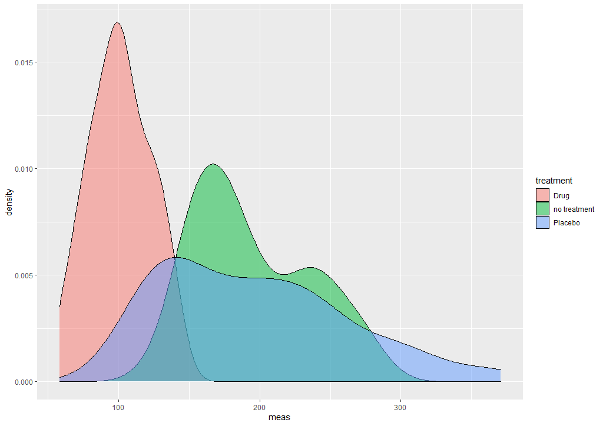
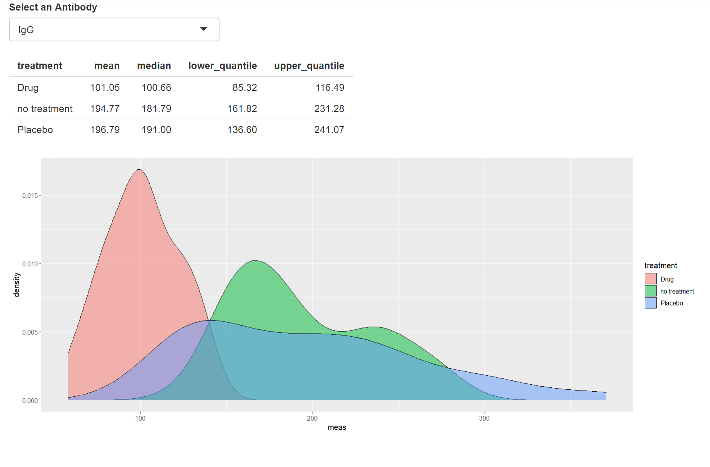

# Why continuous integration will save jour team and your packages

This is a talk given as a *Lightning talk* at the [userR European Hub 2020](https://user2020.r-project.org/). The README will guide you through the talk with code-examples and some tips for best-practices.

## Introduction

Drug development is important for people's life. Especially in the times of COVID-19 you want to make sure drugs get developed fast and secure. Imagine you found a new drug that can change Antibody levels against COVID-19, or any other disease. A statistical evaluation will decide if the drug goes to market or not. Therefore the following questions need to be answered:

* Does it increase/decrease people's Antibody level or not?
* Does the drug perform better or worse compared to a placebo?

Two experiments were carried out to answer this question. One checking IgG Antibody levels, and one checking out IgA antibody levels. In a **real use-case** many more experiments would be carried out. But let's leave it simple.

## Statistical evaluations

To check the drug the clinician ask as for the following statistical evaluations:

1. A summary table showing the Antibody levels with/without treatment including distribution quantiles.
2. A distribution plot of the Antibody levels with/without treatment
3. A shiny-app where the user can switch between the antibodies and see both 


## The standard way of working

So now if a Statistician would see these requirements, he or she would start writing a script, let's call it `summary_script.R` and an app called `app.R`. Maybe some libraries like `dplyr` or `ggplot2` would be used. 

In this case imagine the experimental data would be provided as a list that has the following structure:

```
experimental_data
|- IgG (data.frame)
  |- meas (numeric)
  |- treatment (factor)
|- IgA
  |- meas (numeric)
  |- treatment (factor)
```


### Analysis script

The script would contain something like this:


```r
# ---- * summary table IgG ----
experimental_data$IgG %>%
  dplyr::group_by(treatment) %>%
  dplyr::summarise(
    mean = mean(meas),
    median = median(meas),
    lower_quantile = quantile(meas, 0.25),
    upper_quantile = quantile(meas, 0.75)
  )
  
# ---- * distribution plot IgG ----

ggplot(experimental_data62.           231.$IgG, aes(x = meas, fill = treatment)) +
  geom_density(alpha = 0.5)
```

the outcome would be the following:

```r
# A tibble: 3 x 5
  treatment     mean median lower_quantile upper_quantile
  <fct>        <dbl>  <dbl>          <dbl>          <dbl>
1 Drug          126.   126.           110.           141.
2 no treatment  195.   182.           1
3 Placebo       197.   191.           137.           241.
```



There would be two take aways:

1. The drug lowers the IgG levels by 30%
2. There is no overlap between the `no_treatment` and `drug` distributions (checked for 75% of the patients)

### Analysis App

The same can immediately go into an app:

```r

ui <- function() {
  fluidPage(
    selectInput("antibody", "Select an Antibody", choices = c("IgG", "IgA"), selected = "IgG", multiple = FALSE),
    tableOutput("summary_table"),
    plotOutput("distribution_plot")
  )
}

server <- function(input, output) {
  output$summary_table <- renderTable({
    experimental_data[[input$antibody]] %>%
      dplyr::group_by(treatment) %>%
      dplyr::summarise(
        mean = mean(meas),
        median = median(meas),
        lower_quantile = quantile(meas, 0.25),
        upper_quantile = quantile(meas, 0.75)
      )
  })
  
  output$distribution_plot <- renderPlot({
    ggplot(experimental_data[[input$antibody]], aes(x = meas, fill = treatment)) +
      geom_density(alpha = 0.5)
  })
}

shinyApp(ui, server)
```



## Here comes the problem!

Now imagine you are gone during your vacation and your co-worker get's your code. Additionally there is a request from the Clinician, to add the *Standard Deviation* to the summary table, as the Clinician is familiar with this indicator.

Your co-worker takes your script and changes the following in the `summary_script.R` and `app.R`.

```r
experimental_data$IgG %>%
  dplyr::group_by(treatment) %>%
  dplyr::summarise(
    mean = mean(meas),
    median = median(meas),
    lower_quantile = quantile(meas, 0.01),
    upper_quantile = quantile(meas, 0.99),
    sd = sd(meas)
  )
```
the outcome would be the following:

```r
# A tibble: 3 x 6
  treatment     mean median lower_quantile upper_quantile    sd
  <fct>        <dbl>  <dbl>          <dbl>          <dbl> <dbl>
1 Drug          126.   126.           86.0           166.  21.4
2 no treatment  195.   182.          137.            278.  41.1
3 Placebo       197.   191.          115.            362.  65.7
```

These numbers get reported in the clinical study report. You come back after your vacation and you notice:

:warning: The distributions of `no treatment` and `drug` now overlap :warning:

Why is that? Because your co-worker 
1) A script that runs the table and the plot
2) An app that you can execute to see both. Hopefully the app already contains a shiny-module.

Now imagine your team continuing to develop the summary table and adding new features to it. You still want:

1. The summary values to be right
2. The plot to work
3. The app to work right

How would you enable this? Anytime your co-worker changes the script you would test it? Would you see if he changes quantile levels or renames the inputIDs of the shiny app each time? Maybe not.

There are three things that will make it way easier to collaborate:

1. Version control in e.g. Github
2. Wrapping your code into an R-package with tests
3. Allow changes to version control only upon passing all tests inside a designated environment

Today I want to talk only about **3**. Automatically running checks and tests in a designated environment is what **CI/CD** systems do

