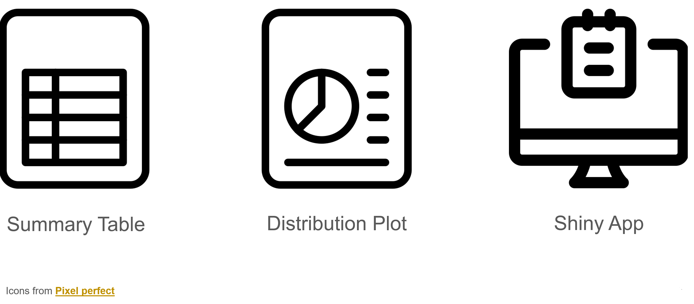
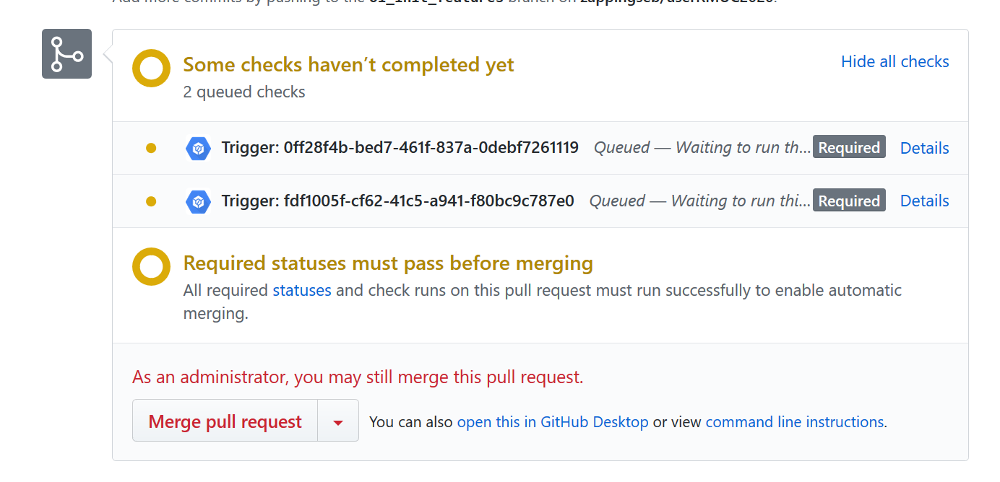

# Why continuous integration will save jour team and your packages

This is a talk given as a *Lightning talk* at the [userR European Hub 2020](https://user2020.r-project.org/). The README will guide you through the talk with code-examples and some tips for best-practices.

## Introduction

Drug development is important for people's life. Especially in the times of COVID-19 you want to make sure drugs get developed fast and secure. Imagine you found a new drug that can change Antibody levels against COVID-19, or any other disease. A statistical evaluation will decide if the drug goes to market or not. Therefore the following questions need to be answered:

* Does it increase/decrease people's Antibody level or not?
* Does the drug perform better or worse compared to a placebo?

Two experiments were carried out to answer this question. One checking IgG Antibody levels, and one checking out IgA antibody levels. In a **real use-case** many more experiments would be carried out. But let's leave it simple.

The following story will show you what can happen if your co-workers mess with your 
## Statistical evaluations

To check the drug the clinician ask as for the following statistical evaluations:

1. A summary table showing the Antibody levels with/without treatment including distribution quantiles. It is
  important for the outcome, that distributions do not overlap for a certain percentage of patients.
2. A distribution plot of the Antibody levels with/without treatment
3. A shiny-app where the user can switch between the antibodies and see both 



## The standard way of working

So now if a Statistician would see these requirements, he or she would start writing a script, let's call it `summary_script.R` and an app called `app.R`. Maybe some libraries like `dplyr` or `ggplot2` would be used. 

In this case imagine the experimental data would be provided as a list that has the following structure:

```
experimental_data
|- IgG (data.frame)
  |- meas (numeric)
  |- treatment (factor)
|- IgA
  |- meas (numeric)
  |- treatment (factor)
```


### Analysis script

The script would contain something like this:


```r
# ---- * summary table IgG ----
experimental_data$IgG %>%
  dplyr::group_by(treatment) %>%
  dplyr::summarise(
    mean = mean(meas),
    median = median(meas),
    lower_quantile = quantile(meas, 0.1),
    upper_quantile = quantile(meas, 0.9)
  )
  
# ---- * distribution plot IgG ----

ggplot(experimental_data$IgG, aes(x = meas, fill = treatment)) +
  geom_density(alpha = 0.5)
```

the outcome would be the following:

```r
# A tibble: 3 x 5
  treatment     mean median lower_quantile upper_quantile
  <fct>        <dbl>  <dbl>          <dbl>          <dbl>
1 Drug          116.   116.           90.3           146.
2 no treatment  195.   182.          149.            253.
3 Placebo       197.   191.          125.            295.
```


There would be two take aways:

1. The drug lowers the IgG levels by 30%.
2. There is no overlap between the `no_treatment` and `drug` distributions (checked for 80% of the patients).

### Analysis App

The same can immediately go into an app:

```r

ui <- function() {
  fluidPage(
    selectInput("antibody", "Select an Antibody", choices = c("IgG", "IgA"), selected = "IgG", multiple = FALSE),
    tableOutput("summary_table"),
    plotOutput("distribution_plot")
  )
}

server <- function(input, output) {
  output$summary_table <- renderTable({
    experimental_data[[input$antibody]] %>%
      dplyr::group_by(treatment) %>%
      dplyr::summarise(
        mean = mean(meas),
        median = median(meas),
        lower_quantile = quantile(meas, 0.25),
        upper_quantile = quantile(meas, 0.75)
      )
  })
  
  output$distribution_plot <- renderPlot({
    ggplot(experimental_data[[input$antibody]], aes(x = meas, fill = treatment)) +
      geom_density(alpha = 0.5)
  })
}

shinyApp(ui, server)
```


## Here comes the problem!

Now imagine you are gone during your vacation and your co-worker get's your code. Additionally there is a request from the Clinician, to add the *Standard Deviation* to the summary table, as the Clinician is familiar with this indicator.

Your co-worker takes your script and changes the following in the `summary_script.R` and `app.R`.

```r
experimental_data$IgG %>%
  dplyr::group_by(treatment) %>%
  dplyr::summarise(
    mean = mean(meas),
    median = median(meas),
    lower_quantile = quantile(meas, 0.01),
    upper_quantile = quantile(meas, 0.99),
    sd = sd(meas)
  )
```
the outcome would be the following:

```r
# A tibble: 3 x 6
  treatment     mean median lower_quantile upper_quantile    sd
  <fct>        <dbl>  <dbl>          <dbl>          <dbl> <dbl>
1 Drug          116.   116.           76.0           156.  21.4
2 no treatment  195.   182.          137.            278.  41.1
3 Placebo       197.   191.          115.            362.  65.7
```

These numbers get reported in the clinical study report. You come back after your vacation and you notice:

:warning: The distributions of `no treatment` and `drug` now overlap :warning:

*What is critical about this?* The drug might not go to market, because this was an exclusion criterium for
the drug. These distributions shall not overlap.

*Why is that?* Because your co-worker did not only add the `sd`, but also changed the quantile levels from 90% to 99%.

*How long will it take you to find this?* This depends on how you have stored the script, if you can compare values. How did you store the app...

*How can you avoid this?* This is what the following chapter is about!

## Enhancing collaboration on data science projects in R

There are three things that will make it way easier to collaborate:

### Version control in e.g. Github

makes it easy to track changes and even revert them.

### Wrapping your code into an R-package with tests

Allows you to have some basic documentation, double check by `R CMD check` everytime a new user adds code.

### Run checks automatically

Running checks every time a user changes your code, allows you to control:

* act fast!
* the environment the checks run in
* the possibility to add code to your code-base
* give coders feedback without needing to ask their co-workers

---

All three topics are important for R-coding. But as *Version Control* and *R packages* are a standard in developing R. I will only focus on *Run checks automatically*

## Automatic checks

So now imagine, instead of writing a `summary_script.R` and `app.R` file you did the following:

* Wrap everything into an R-package
* Write a function `summary_table`
* Write a function `summary_plot`
* Include a shiny-module called `summaryModule` with the functions `summaryUI` and `summaryServer`
* Store your code inside Github and protect the `master` branch from direct commits

## How to make it fail proof?

### Include a test for the numerics

As a first input, I recommend using [`testthat`](https://testthat.r-lib.org/) to test your R package. To use it
you need to include a file `testthat.R` in the `tests` folder of your package. This file only contains the code

```r
library(testthat)

testthat::test_check("useRMUCDemo")
```

Then you continue and create the directory `tests/testthat` inside which you create the file `test_numerics.R`. This file contains a check for the quantiles for an example data set:

```r
context("numerical testing")

test_that("summary table", {
  data("experimental_data")
  
  result <- expect_silent(summary_table(experimental_data$IgG$meas, experimental_data$IgG$treatment))
  
  expect_equal(
    result$lower_quantile,
    c(90.29758, 149.46806, 125.22527)
  )
  
  result <- expect_silent(summary_table(experimental_data$IgA$meas, experimental_data$IgA$treatment))
  
  expect_equal(
    result$lower_quantile,
    c(23, 20, 15)
  )
})

```

Now if you run `devtools::test()` inside your package, you will get this output:

```r
Loading useRMUCDemo
Testing useRMUCDemo
√ |  OK F W S | Context
√ |   4       | numerical testing

== Results =====================================================================
OK:       4
Failed:   0
Warnings: 0
Skipped:  0
```

These checks will also run if you use `R CMD check`.

### Include an app for shinytest

A guide on how to use shinytest in an R-package can be found here: https://rstudio.github.io/shinytest/articles/package.html.

After you have read the guide, you can setup a test app like this:

```r
source("../shinytest_load_pckg.R")

eval(shinytest_load_pckg("useRMUCDemo"))

data(experimental_data)

ui <- fluidPage(
  summaryUI("counter1", dataset = experimental_data)
)

server <- function(input, output, session) {
  callModule(summaryServer, "counter1", dataset = experimental_data)
}

shinyApp(ui, server)
```

`shinytest_load_pckg` will provide some code to load the package while in `devtools::test()` or `devtools::check()` or `R CMD check`. Because all of those have different behaviour.

Now you can store the app inside `tests/testthat/app_test/app.R` and record a shinytest.

```r
shinytest::recordTest("app_test")
```

Creating a file `tests/testthat/test_app.R` with this content will allow to test the app within `devtools::test()`:

```r
library(shinytest)
context("App with table and plot")
test_that("app works", {
  expect_pass(testApp("app_test", compareImages = FALSE, interactive = FALSE))
})

### Use Jenkins / Travis CI / GoogleCloudBuild for automatic testing

Now you need to include any CI tool to automatically run package checks upon pushing to Github. There are several guides available for this:

* [Travis CI for R — Advanced guide](https://towardsdatascience.com/travis-ci-for-r-advanced-guide-719cb2d9e0e5?gi=906d5a74e98b)
* [ R scripts in the cloud, via Cloud Run, Cloud Build and Cloud Scheduler.](https://code.markedmondson.me/googleCloudRunner/)
* [How to test your internal packages - discussion](https://community.rstudio.com/t/how-do-you-test-your-internal-packages-travis-jenkins-by-hand/13002)

This example project was setup with [GoogleCloudBuild](https://console.cloud.google.com/cloud-build/builds/f2bfda2f-4c67-4c9c-b73d-9bd031220699?project=736775587969)

## See what happens upon a user changing code the wrong way

The `master` branch of your project should be protected. There are several ways to do so depending on whether you use Github, Gitlab or Bitbucket. This means anyone who wants to contribute to your code needs to open a **Pull Request** or **Merge Request**.

On Github this can be done for this repo at: https://github.com/zappingseb/userRMUC2020/compare and looks like this:


After creating the **Pull Request** Google Cloud Build will automatically start to check the code and prevent the user from merging:

